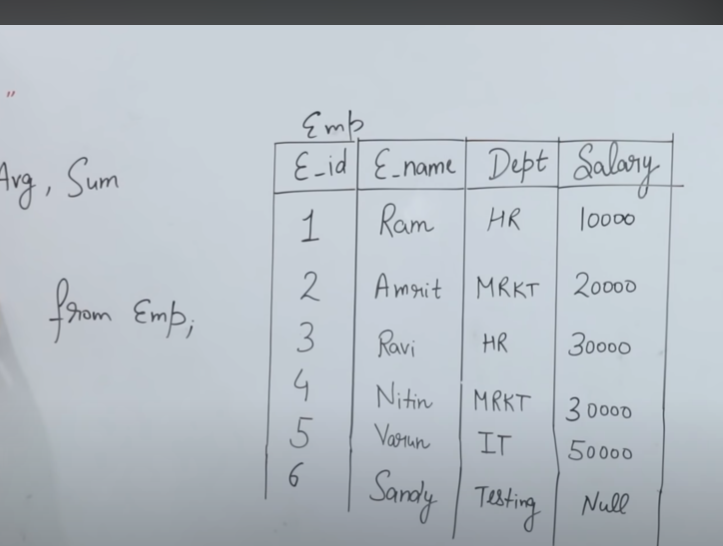

# SQL Agregate functions

- SQL Aggregate Functions: SUM(), COUNT(), AVG()

- What Is an Aggregate Function in SQL?

- An aggregate function in SQL performs a calculation on multiple values and returns a single value. SQL provides many aggregate functions that include avg, count, sum, min, max, etc. An aggregate function ignores NULL values when it performs the calculation, except for the count function. 

